

  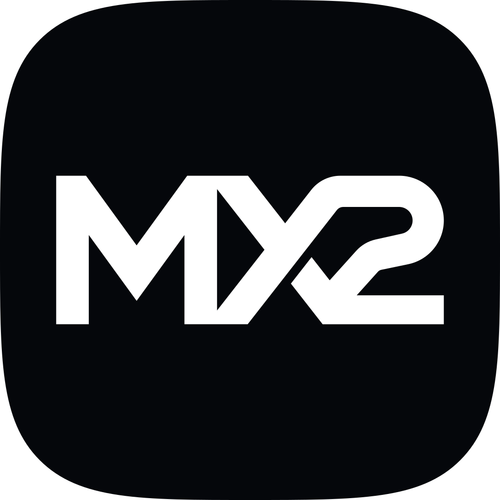

  # Mx2

  **A local-first personal operating system for knowledge, work, voice and AI.**

  Product design · AI systems · Desktop engineering

## Overview

I designed and built Mx2 to unify my knowledge, work, files, voice and AI in one native desktop environment.

Most personal tools solve one part of the problem. Notes store information. AI chats answer questions. Task apps track work. File managers hold assets. The user is still responsible for carrying context between them.

Mx2 takes a different position: the environment owns the continuity. Models can change, tools can evolve and data sources can grow, while the product keeps one identity, one memory and one interaction system.

> This repository is a product and engineering case study. The application source and personal data remain private by design.

## The problem

My work crosses design, music, client production and software. The information behind that work lived across notes, folders, cloud services and isolated AI conversations.

The issue was not a lack of capable tools. It was the absence of a system connecting them.

- AI conversations forgot decisions made elsewhere.
- Knowledge tools stored information but did not help act on it.
- Automation interfaces felt like control panels rather than a daily product.
- Each additional tool created another place to search and another interaction model to learn.

The product goal became simple: **one coherent system, built around the person rather than the provider.**

## Product principles

| Principle | Product consequence |
| --- | --- |
| One system | Every capability follows the same navigation, visual language and interaction model. |
| Local first | Knowledge, embeddings, databases, audio and credentials stay under the user's control whenever possible. |
| Models are engines | Claude and Codex run behind one contract and one router. Either can be swapped or switched off without changing the product. |
| Memory must be durable | Corrections, preferences, decisions and lessons survive individual conversations. |
| Actions need boundaries | Sensitive data and irreversible operations stay behind explicit technical and human gates. |
| Performance is designed | Navigation is measured and tuned for a 240 Hz display rather than accepted by feel alone. |

## By the numbers

Figures from the private repository as of September 2026.

| | |
| --- | --- |
| Source | 114,000 lines of TypeScript across 116 backend services and 53 views |
| Verification | 705 automated tests in 52 suites, plus scripted verification inside the running app |
| Agent surface | 44 MCP tools shared by Claude Code, Codex and Cursor, and a roster of 13 specialized agents |
| Engines | Two interchangeable AI engines behind a single contract, with a parity suite that runs every capability against both |
| Voice | About 1.7 seconds from the end of the user's sentence to the first spoken word, with wake word and barge-in |
| History | 479 commits since June 27, 2026 |

## Product tour

Every screenshot below comes from a demonstration profile: the same build, a separate data folder and a fictional user (a design and print studio in Valparaíso, a music alias, personal projects). No personal data is shown, and the profile cannot read the real one.

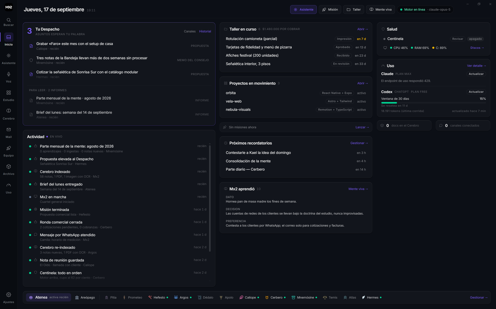

**Home.** One board for the day: proposals and reports from the agents waiting for a decision, live activity, the workshop, projects, reminders, what the memory learned recently, system health and the usage of both AI subscriptions.

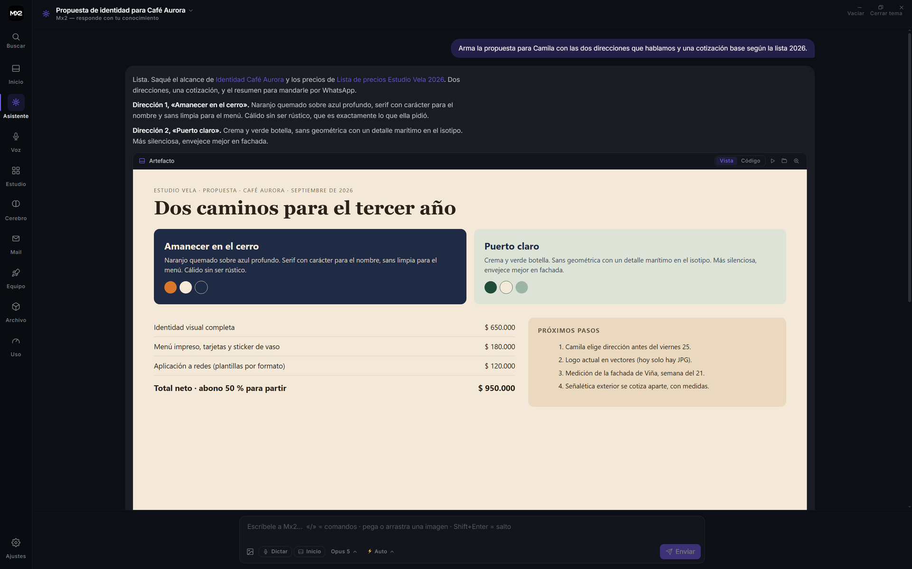

**Assistant.** A native chat with the engines. Answers cite the user's own notes, and an artifact renders inline: here, a client proposal the assistant assembled from the knowledge base and the price list.

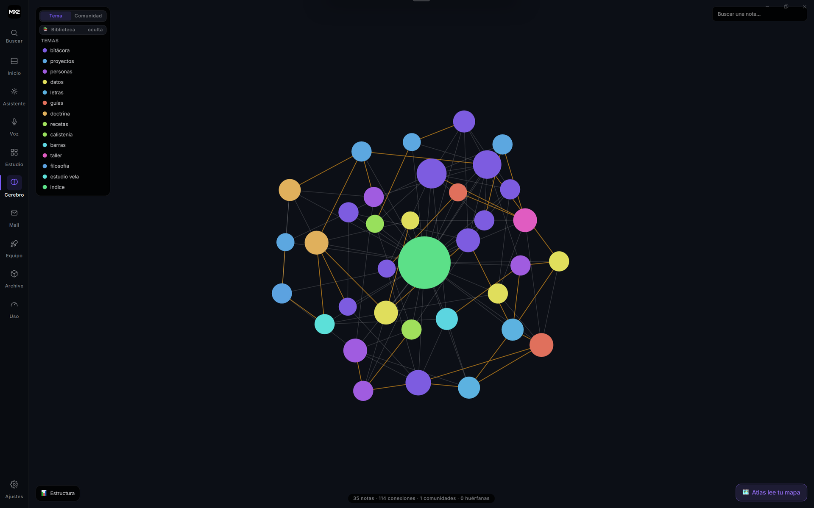

**Brain map.** Every note is a node. Explicit links and relationships inferred from meaning connect them; size follows centrality, color follows theme, and orphans stand out so they can be woven in.

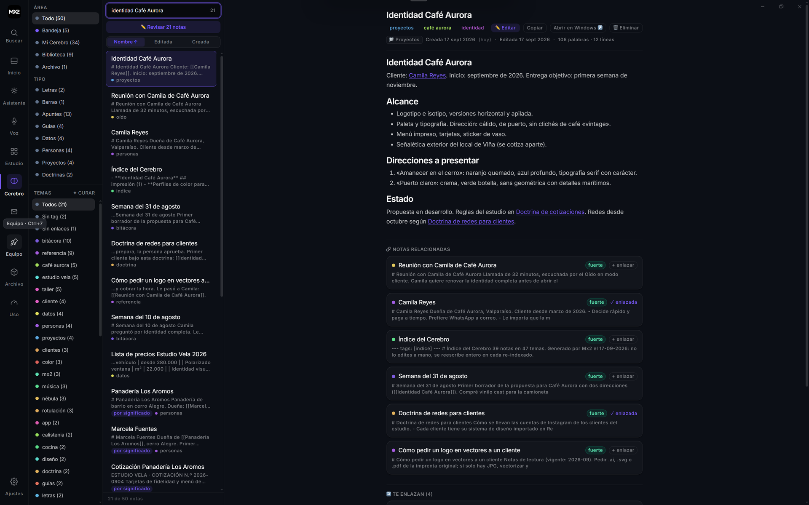

**Notes.** Search by words or by meaning, read the note with its links resolved, and see which notes are related even when nothing links them explicitly.

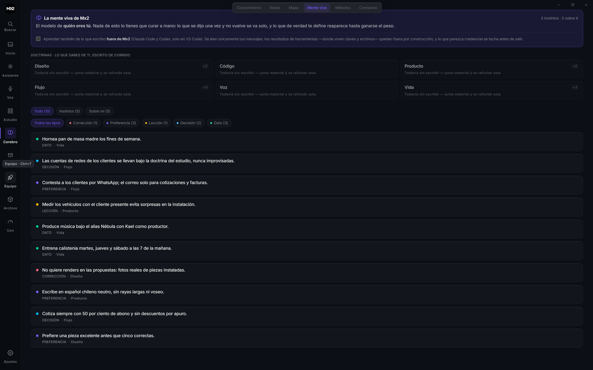

**Living memory.** What Mx2 knows about its user, as durable facts with a type, a domain and a shelf. Instincts are the few that shape every turn. Learning from external coding sessions is a switch, off by default here.

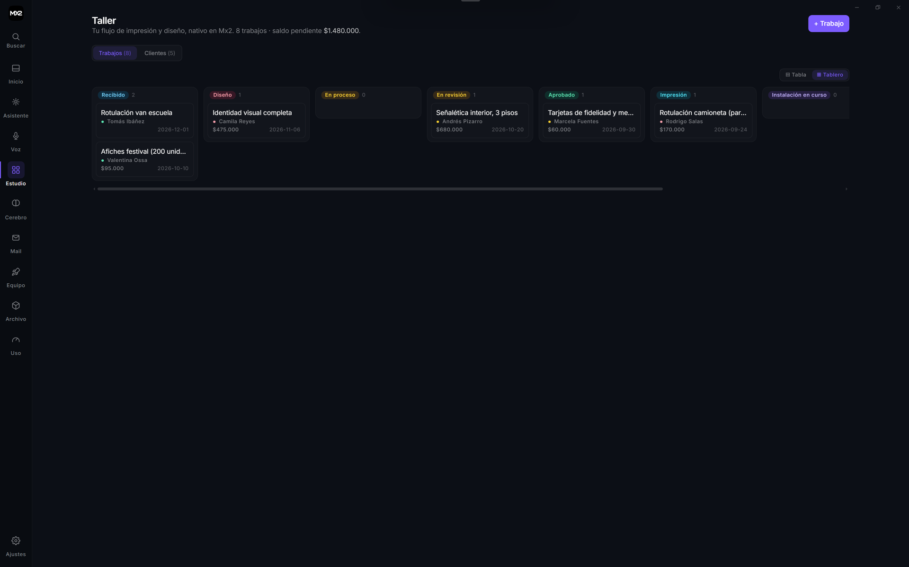

**Workshop.** A small client CRM for a print and design business: jobs by stage, balances, deadlines and materials, native to the same system as everything else.

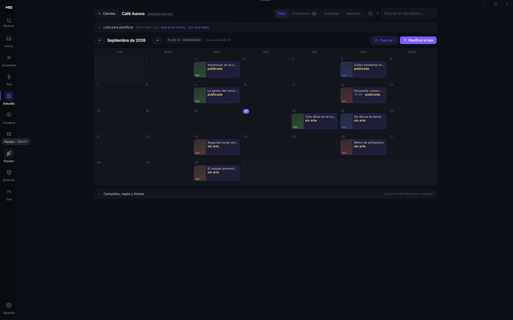

**Social media pipeline.** One folder per client brand with its design system, strategy and monthly plan. Pieces move from idea to approval to publication, and nothing is posted without a person approving it.

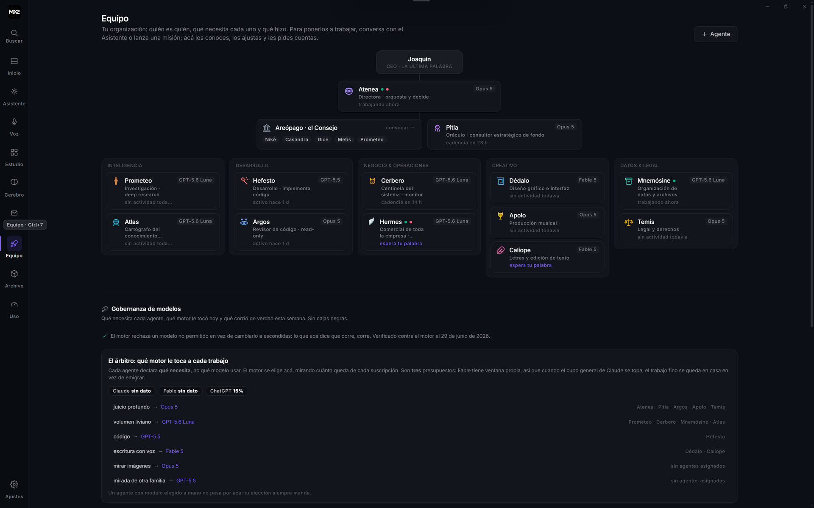

**Team.** The agents as an organization: a director, a council, departments, and a governance panel that shows which engine each kind of work gets and how much quota remains.

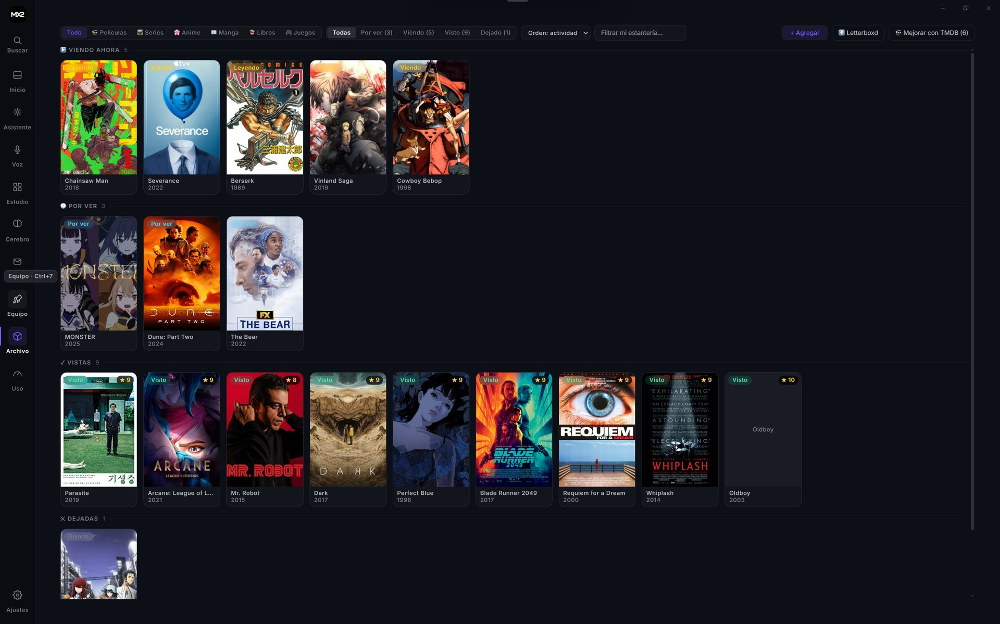

**Collection.** Films, series, anime, manga and books as a poster wall, with covers resolved from public catalogs and no API key required.

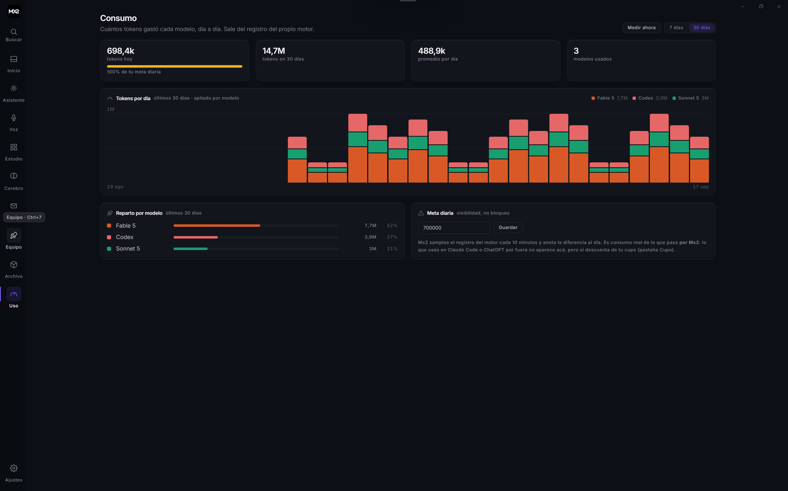

**Usage.** Tokens per day stacked by model, engine turns with their failure causes, and a daily budget that informs rather than blocks.

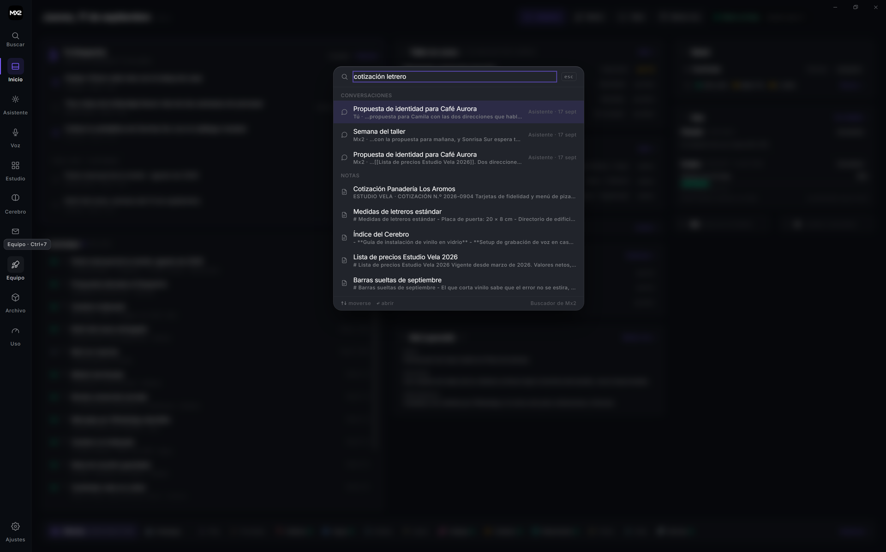

**Search everywhere.** One shortcut searches conversations, notes, contacts, jobs and messages at once.

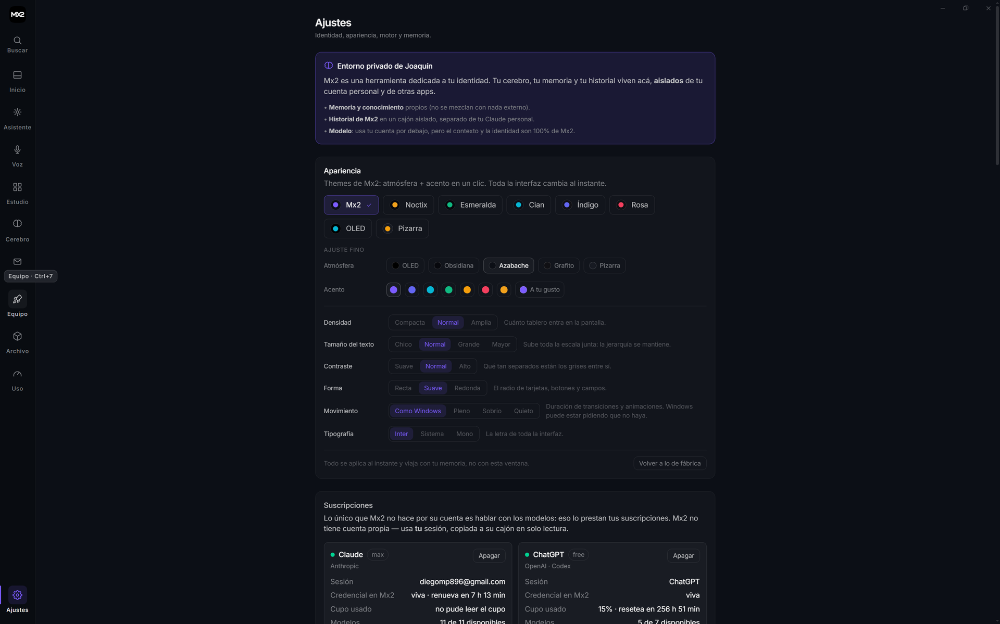

**Appearance.** Eight presets and seven axes (atmosphere, accent, density, text size, contrast, shape, motion, typography) applied instantly and stored with the user's memory, not the window.

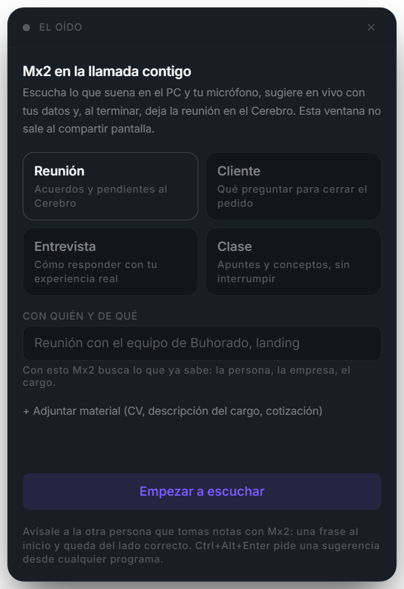

**Call listening.** A small always-on-top window that listens to the system audio and the microphone on separate channels, suggests answers from the user's own data during the call, and files a structured note when it ends. It is hidden from screen sharing by design.

## System map

  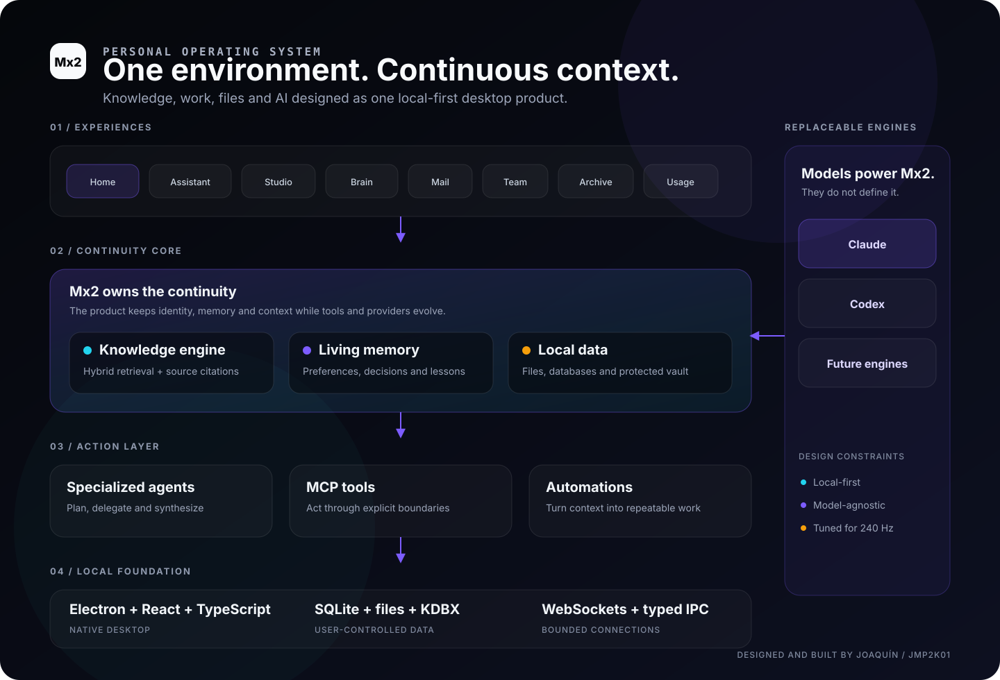

View the architecture as a Mermaid diagram

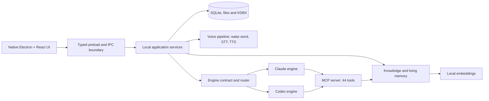

The architecture separates the product from the model. Mx2 owns the interface, local data, memory, retrieval, voice and safety rules. The engines remain replaceable infrastructure: every capability is exercised against both of them by an automated parity suite, and the app runs with one, the other or both.

## Selected systems

### Living memory

Mx2 captures durable corrections, preferences, lessons, decisions and facts about its user. Each learning carries confidence and reinforcement, so repeated truths get stronger and stale assumptions fade instead of memory becoming an unfiltered transcript. The same memory is exposed to external coding agents through MCP, so switching between Claude Code, Codex and Cursor never costs context.

### Local knowledge engine

The knowledge system indexes local notes, documents, PDFs and screenshots. PDFs without a text layer are rendered and passed through local OCR. Search combines BM25 keyword relevance with multilingual semantic embeddings, fused by reciprocal rank fusion, and returns answers with source citations. A force-directed map shows explicit links and relationships inferred by meaning.

### Voice as a first-class interface

A local pipeline listens for a wake word, transcribes with whisper.cpp, answers through a low-latency reasoning lane and speaks with a single, chosen voice. The user can interrupt mid-sentence. A second capability, built on the same pipeline, listens to calls through the system loopback and the microphone on two separate channels, suggests answers in under a second from the user's own data, and files a structured meeting note when the call ends. The listening window is hidden from screen sharing by design.

### Two engines, one product

Claude and Codex are integrated as peers behind one contract of 26 methods and a router that chooses by declared need and by remaining quota. Model catalogs are discovered automatically. Per-agent permissions, weekly budgets and cancellation are enforced by the product, not by the model.

### Team of agents

A roster of specialized agents with departments, an organization chart and explicit permission gates. Agents publish reports and proposals to a dispatch inbox; approving a proposal is what executes it. Scheduled cadences cover commercial rounds, memory consolidation and weekly briefs.

### Untrusted content quarantine

Email, RSS, social media and web content enter through a fail-closed quarantine that detects instruction injection before any text reaches an agent. Untrusted email HTML renders inside a sandboxed frame with its own content security policy. Nothing in the product sends, publishes or replies to a real person without a human pressing the button.

### Documents

One document gateway serves the whole product: PDFium in WebAssembly for text and page rendering, local OCR for scanned or outlined pages, an in-app viewer, HTML-to-PDF generation for quotes and reports, and an optional deep-reading lane with Docling for tables and structure.

### Work and life hubs

Nine primary areas organize the product by real usage: Home, Assistant, Voice, Studio, Brain, Mail, Team, Archive and Usage. New capabilities enter an existing hub instead of growing an endless sidebar. The Studio hosts a multi-client social media pipeline, a client workshop and a data-driven music video engine built on Remotion.

### Local security boundaries

Credential storage uses the KeePass-compatible KDBX format with Argon2. Agent tools cannot access the vault. Privileged operations stay behind Electron's preload and IPC boundary, and the OAuth credentials that power the engines are read-only for the product.

### 240 Hz interaction work

Large views stay mounted after their first visit and move off-screen through compositor transforms. Memoized view trees, deferred `inert` updates and explicit pausing for heavy visualizations avoid paying the same mount and layout costs on every navigation.

## A defining product decision

An early version embedded the engine's existing web control panel inside Mx2. It worked, but the result felt like two products placed next to each other.

I chose the longer path: rebuild the important capabilities as native Mx2 interfaces and leave the engine invisible. That decision shaped the whole product. Integration quality mattered more than shipping a visually disconnected shortcut.

## Working method

Mx2 is built with AI coding agents as the method, and with product direction, visual judgment, verification and final decisions kept human.

- One rules file is the single source of truth for every environment (Claude Code, Codex, Cursor and the agents inside Mx2), and a check fails when derived copies drift.
- Every change is verified inside the running application through the Chrome DevTools Protocol: screenshots, clicks and evaluated state, not only unit tests.
- Performance, bundle budget and the parity between engines are measured by scripts that run before a release.
- Design decisions live in a documented visual system with fixed type scales, surfaces and motion tokens, so new screens do not drift.

## Technology

| Area | Tools |
| --- | --- |
| Desktop | Electron, electron-vite, electron-builder |
| Interface | React, TypeScript, Tailwind CSS v4, Web Animations API |
| Local data | Native SQLite with WAL, local files, TipTap, KDBX |
| AI systems | Claude and Codex CLIs behind one contract and router, MCP server, Groq for the low-latency voice lane |
| Retrieval | Transformers.js, multilingual e5 embeddings, BM25 plus semantic fusion |
| Voice | whisper.cpp, openWakeWord, Edge TTS, energy-based voice activity detection, system loopback capture |
| Documents | PDFium (WebAssembly), Windows OCR, Chromium print engine, Docling |
| Media | Remotion for programmatic video, ComfyUI for local image generation |
| Visualization | react-force-graph-2d, Canvas |
| Distribution | Windows NSIS installer |

## Timeline

| When | Milestone |
| --- | --- |
| June 2026 | Native rebuild starts. The engine becomes invisible infrastructure. |
| July 2026 | Hubs, living memory, knowledge network, credential vault, 240 Hz navigation work. |
| August 2026 | Team of agents with dispatch inbox, social media pipeline, mail with quarantine, video studio. |
| September 2026 | Two engines as peers with parity suite, native SQLite, single voice, call listening, document gateway. |

## What this project demonstrates

- Turning an open-ended personal ambition into a coherent product architecture.
- Designing AI as infrastructure rather than as the entire product.
- Connecting local-first data, retrieval, agents, voice and desktop workflows.
- Making explicit safety decisions around credentials, untrusted content and irreversible actions.
- Measuring interaction costs and redesigning navigation around real performance evidence.
- Using AI-assisted development while keeping product direction, visual judgment and final decisions human.

## Status

Mx2 is an active private R&D project built for one real user. This case study documents the product thinking, architecture and selected implementation decisions without publishing personal information, credentials or the private application source.

  <a href="https://github.com/JMP2K01">Back to Joaquín's GitHub profile</a>

